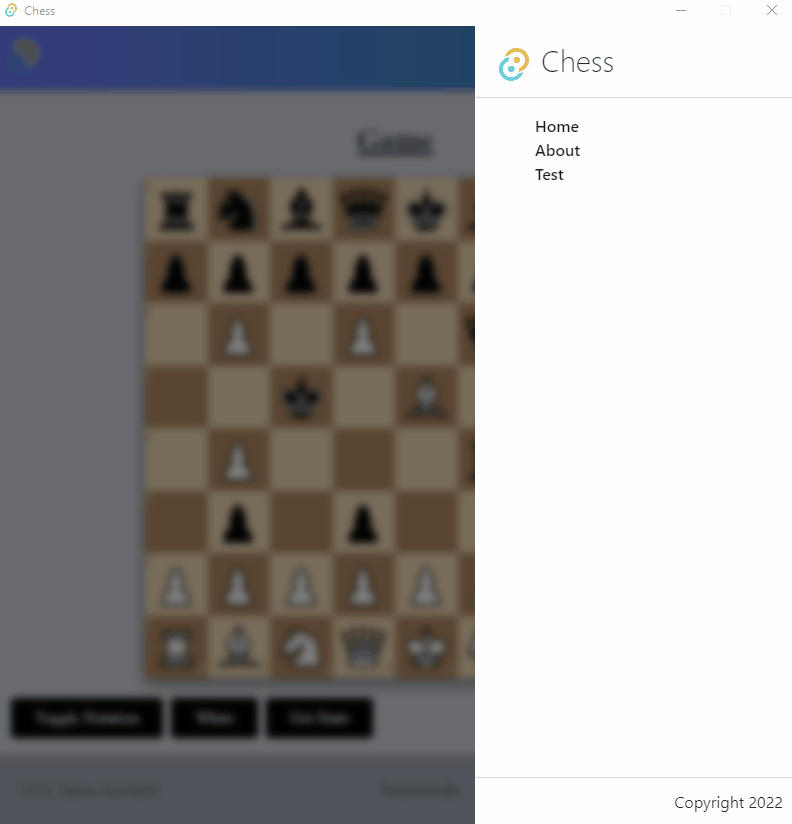
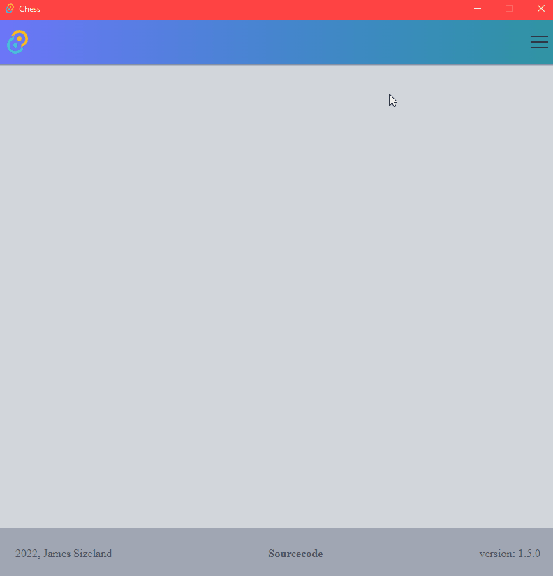
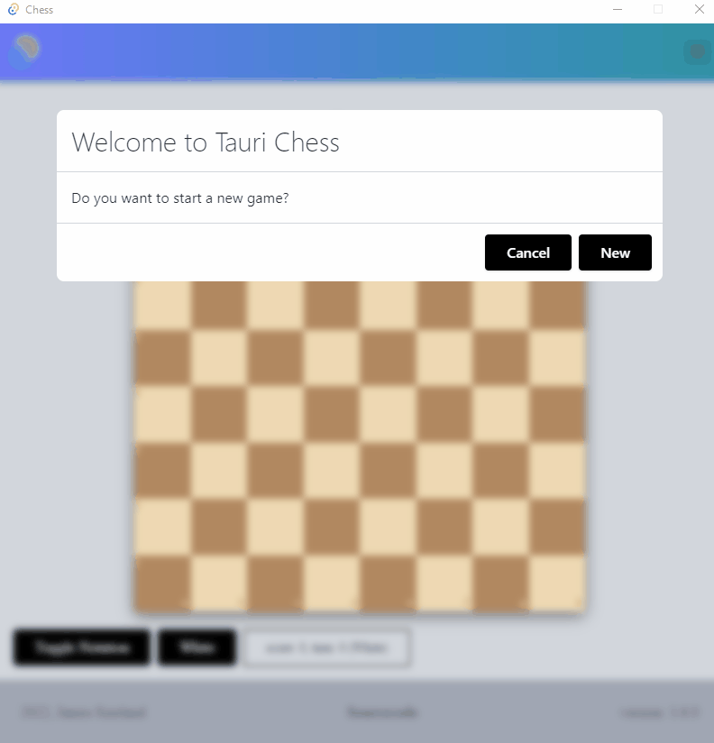
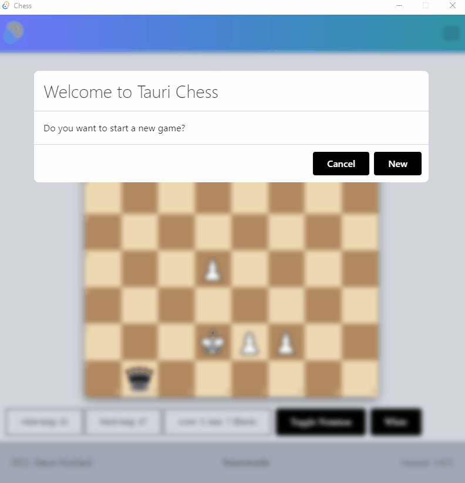
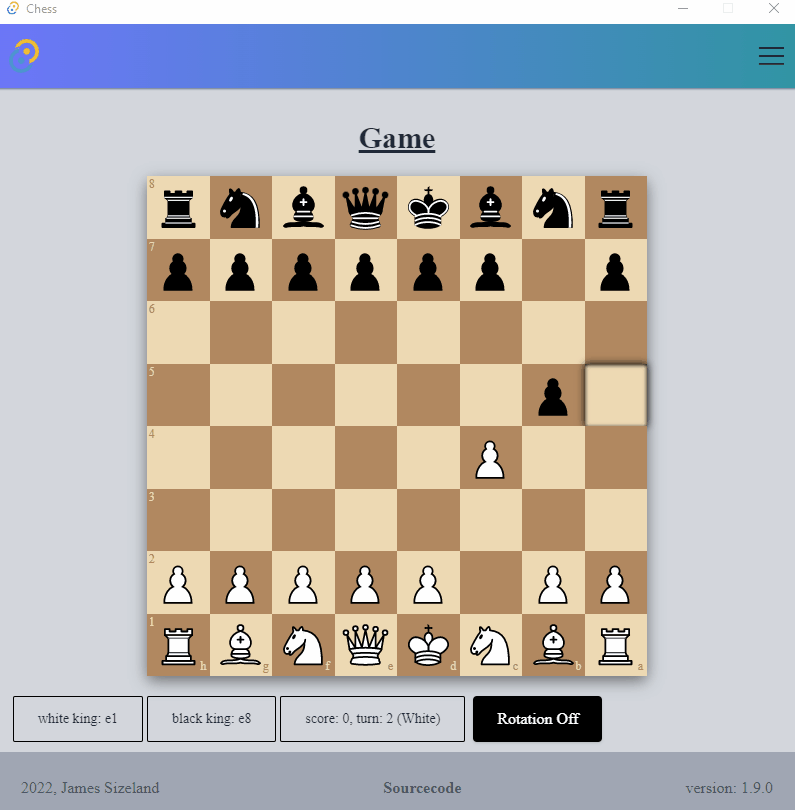

# Tauri Chess App

Experiment with tauri passing data from rust to javascript, by creating a chess app where all of the logic is done in Rust and just the frontend is done in TypeScript React.

## Try It Out!

**Requirements**

- [git](https://git-scm.com/)
- [rust](https://www.rust-lang.org/)
- [node](https://nodejs.org/)
- [yarn](https://yarnpkg.com/getting-started/install)

Use these steps to run and see the magic for yourself!

1. `git clone https://github.com/jamessizeland/tauri-chess.git`
2. `cd tauri-chess`
3. `yarn`
4. `yarn tauri dev`

## UI Basics

## Moves

## Turns

## Checking

## Special Moves

### Enpassant, Promoting & Castling

